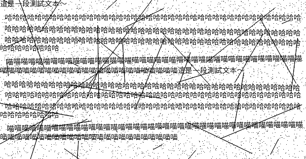

# Anti-OCR

https://www.anti-ocr.ml/

這是一個用於對抗文字識別的工具

本工具可以將文字通過隨機畫點/線以及旋轉，轉換爲可以幹擾OCR識別的圖片

測試效果

識別結果：

圖像輸
·像輸入,
目前有Ope
前處
;不同
Cximage
,不的
式
處.
包括二值化,噪
.對攝像攝的圖片,大多
先,色圖進行
背景息為白
片只剩下
化圖
對
正等。
聲的定義
色
分
的影
斤信,巨大,對於圖片的
的定義前景信息
徵進行去
去除
傾斜校正
傾,-就需
將
文
文
分
戶,在
出來的不可
'由於實榴
制了片
後來以為
影特徵
段落不,位
的產
字符切割:由於拍,
吊成宇符
尸了,
文孛位
順序不地
的,
是CNN
2〕的
在
牜寺定-言
29年由斗
Hadd提
王教
NCT
結果進行校正,
先提出
行,',中國早OCR
大發出來的,,在美國市場投入商業使用
N+RNN*;Attent
